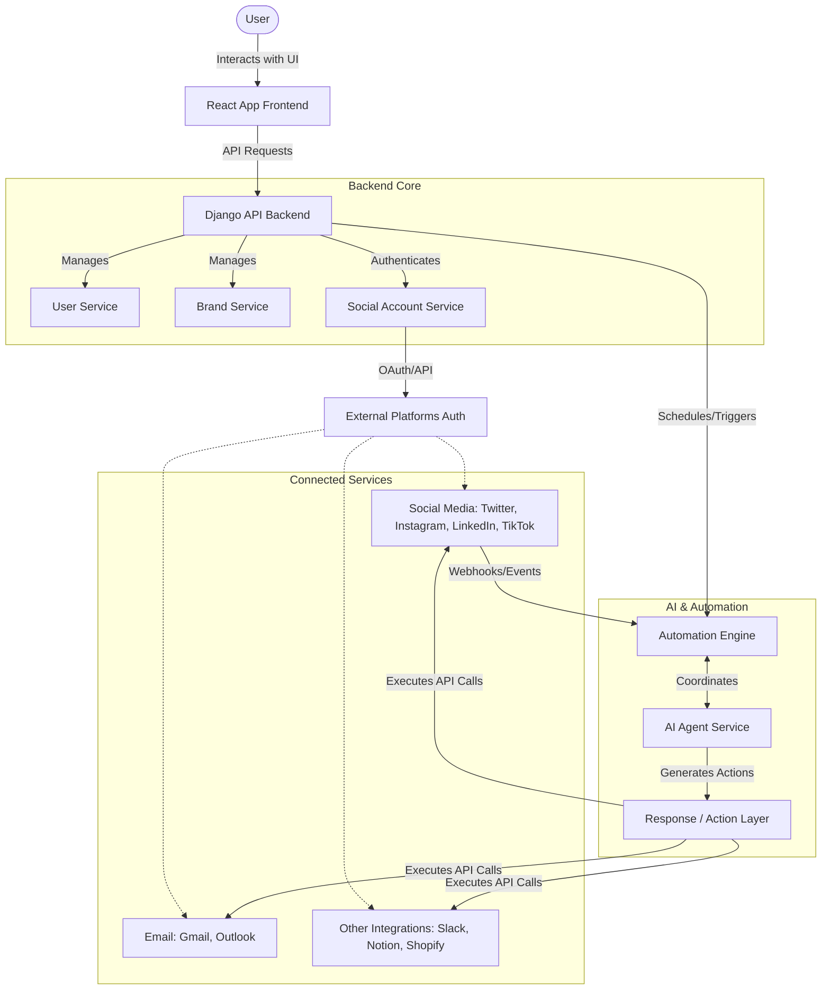

# SyncflowAI Architecture (High-Level)

## Overview
This document provides a high-level view of how SyncflowAI components interact, from user actions to AI agents performing tasks across connected services.

## Architecture Diagram

## List of Services

Based on our system design, the key services driving the SyncflowAI platform are:

- **User Service**: Manages user accounts, authentication, user profiles, and settings.
- **Brand Service**: Stores brand information and configurations, managing linked accounts for each brand.
- **Social Account Service**: Connects to external platforms (Instagram, Twitter, LinkedIn, TikTok, etc.) and handles ongoing authentication and permissions.
- **AI Agent Service**: Monitors activities across connected accounts, generates context-aware actions or responses, and maintains state and workflow history for agents.
- **Automation Engine**: Executes scheduled tasks and workflows, handles triggers from AI agents, and interacts with APIs of connected platforms.
- **Response / Action Layer**: Sends automated messages, posts, or other actions to external platforms, and logs all activities for auditing and tracking.

## Component Roles

- **User** – Interacts with the platform through the frontend.
- **React App** – Displays the dashboard, manages input, and communicates with backend APIs.
- **Django API** – Handles authentication, business logic, task scheduling, and data persistence.
- **Agent Engine** – Executes AI-driven workflows like responding to comments, generating content, and posting.
- **Connected Services** – External platforms and tools that the AI agents interact with to perform tasks.

## Data Flow Explanation

The flow of data and execution through the SyncflowAI platform generally follows these steps:

1. **User Configuration**: The User interacts with the React App (frontend) to configure brands, link social accounts, and define AI agent instructions.
2. **Settings Persistence**: The React App sends these configurations via API requests to the Django API (backend), which stores them using the **User Service** and **Brand Service**.
3. **Platform Authentication**: The **Social Account Service** handles the standard OAuth flows to authorize the platform to act on behalf of the user's Connected Services (e.g., Twitter, LinkedIn).
4. **Event Ingestion**: When an external event occurs (like a new mention or comment on a connected social account), a webhook or scheduled poll sends the data back to the **Automation Engine**.
5. **AI Processing**: The Automation Engine parses the incoming event and passes the relevant context to the **AI Agent Service**. The AI Agent evaluates the context against the user's defined instructions and generates an appropriate response or action.
6. **Action Execution**: The generated action is formatted and passed to the **Response / Action Layer**, which executes the corresponding API calls to external Connected Services (e.g., posting a reply).
7. **Logging and Feedback**: The outcome of the action is logged in the system. The User can subsequently view these logs, analytics, and metrics via the React App dashboard.

## Notes
- Each component is modular to allow independent scaling and testing.
- The Agent Engine can run multiple workflows simultaneously across multiple accounts.
- APIs and integrations are designed to be extensible for future platforms and services.
