# SyncflowAI Models Blueprint

This document defines the Django data models, their fields, types, and database schema relationships.

## Overview of Relationships
- **User** 1 <--> N **Brand** (A user can own multiple brands)
- **Brand** 1 <--> N **SocialAccount** (A brand can have multiple connected social accounts)
- **SocialAccount** 1 <--> N **Agent** (A social account can have multiple AI agents monitoring/acting on it)
- **Agent** 1 <--> N **AgentTask** (An agent can execute multiple tasks)
- **AgentTask** 1 <--> N **AutomationRule** (A task can trigger multiple automation rules)

> **Note on Many-to-Many**: For future features, we can introduce a many-to-many relationship for `Users collaborating on Brands` and `Agents subscribed to multiple SocialAccounts`. For now, we adhere to the 1-to-many baseline.

---

## 1. User
We will use Django's `AbstractUser` or the default `User` model (`django.contrib.auth.models.User`), which covers standard user fields.

**Fields:**
- `id`: `AutoField` (Primary Key)
- `first_name`: `CharField(max_length=150)`
- `last_name`: `CharField(max_length=150)`
- `email`: `EmailField(unique=True)`
- `password`: `CharField` (Handled by Django auth)

**Relationships:**
- Has many **Brands**

---

## 2. Brand
Represents a brand or business entity managed by a User.

**Fields:**
- `id`: `AutoField` (Primary Key)
- `name`: `CharField(max_length=100)`
- `description`: `TextField(blank=True, null=True)`
- `created_at`: `DateTimeField(auto_now_add=True)`
- `updated_at`: `DateTimeField(auto_now=True)`

**Relationships:**
- `owner`: `ForeignKey(User, on_delete=models.CASCADE, related_name='brands')`
- Has many **SocialAccounts**

**Indexes:**
- Index on `owner_id` for fast querying by user.

---

## 3. SocialAccount
Represents a connected external social media or service account.

**Fields:**
- `id`: `AutoField` (Primary Key)
- `platform_name`: `CharField(max_length=50)` (e.g., 'twitter', 'linkedin', 'instagram')
- `account_id`: `CharField(max_length=100)` (External platform's ID for the account)
- `access_token`: `TextField()` (Stored securely/encrypted)
- `created_at`: `DateTimeField(auto_now_add=True)`
- `updated_at`: `DateTimeField(auto_now=True)`

**Relationships:**
- `brand`: `ForeignKey(Brand, on_delete=models.CASCADE, related_name='social_accounts')`
- Has many **Agents**

**Indexes:**
- Index on `brand_id`.
- Composite Index on `[platform_name, account_id]`.

---

## 4. Agent
Represents an AI agent assigned to a social account.

**Fields:**
- `id`: `AutoField` (Primary Key)
- `name`: `CharField(max_length=100)`
- `description`: `TextField(blank=True, null=True)`
- `is_active`: `BooleanField(default=True)`
- `created_at`: `DateTimeField(auto_now_add=True)`
- `updated_at`: `DateTimeField(auto_now=True)`

**Relationships:**
- `social_account`: `ForeignKey(SocialAccount, on_delete=models.CASCADE, related_name='agents')`
- Has many **AgentTasks**

**Indexes:**
- Index on `social_account_id`.

---

## 5. AgentTask
Represents a specific task executed by an AI Agent.

**Fields:**
- `id`: `AutoField` (Primary Key)
- `task_type`: `CharField(max_length=50)` (e.g., 'post_tweet', 'reply_comment')
- `parameters`: `JSONField(default=dict)` (Task-specific configuration and data)
- `status`: `BooleanField(default=False)` (False = Pending, True = Completed OR use CharChoices for 'PENDING', 'COMPLETED', 'FAILED')
- `created_at`: `DateTimeField(auto_now_add=True)`
- `updated_at`: `DateTimeField(auto_now=True)`

**Relationships:**
- `agent`: `ForeignKey(Agent, on_delete=models.CASCADE, related_name='tasks')`
- Has many **AutomationRules** (or may be triggered by them depending on the context).

**Example JSON structure for `parameters`:**
```json
{
  "content": "Check out our new launch!",
  "media_urls": ["https://example.com/image.png"],
  "schedule_time": "2026-03-10T14:00:00Z"
}
```

**Indexes:**
- Index on `agent_id`.
- Index on `status` (for quickly fetching pending tasks).

---

## 6. AutomationRule
Represents rules that govern when tasks are triggered.

**Fields:**
- `id`: `AutoField` (Primary Key)
- `name`: `CharField(max_length=100)`
- `trigger_condition`: `JSONField(default=dict)` (Defines when the rule should fire)
- `action`: `JSONField(default=dict)` (Defines what should happen)
- `is_active`: `BooleanField(default=True)`
- `created_at`: `DateTimeField(auto_now_add=True)`
- `updated_at`: `DateTimeField(auto_now=True)`

**Relationships:**
- `agent_task`: `ForeignKey(AgentTask, on_delete=models.CASCADE, related_name='automation_rules')`

**Example JSON structure for `trigger_condition`:**
```json
{
  "event_type": "keyword_mention",
  "keywords": ["AI", "Syncflow"],
  "sentiment": "positive"
}
```

**Example JSON structure for `action`:**
```json
{
  "action_type": "auto_reply",
  "template_id": "reply_001",
  "approval_required": true
}
```

**Indexes:**
- Index on `agent_task_id`.

---

## ER Diagram (Mermaid)

```mermaid
erDiagram
    USER ||--o{ BRAND : "owns"
    USER {
        int id PK
        string first_name
        string last_name
        string email
        string password
    }

    BRAND ||--o{ SOCIALACCOUNT : "connects"
    BRAND {
        int id PK
        string name
        text description
        datetime created_at
        datetime updated_at
        int owner_id FK
    }

    SOCIALACCOUNT ||--o{ AGENT : "has"
    SOCIALACCOUNT {
        int id PK
        string platform_name
        string account_id
        text access_token
        datetime created_at
        datetime updated_at
        int brand_id FK
    }

    AGENT ||--o{ AGENTTASK : "executes"
    AGENT {
        int id PK
        string name
        text description
        boolean is_active
        datetime created_at
        datetime updated_at
        int social_account_id FK
    }

    AGENTTASK ||--o{ AUTOMATIONRULE : "triggers"
    AGENTTASK {
        int id PK
        string task_type
        json parameters
        boolean status
        datetime created_at
        datetime updated_at
        int agent_id FK
    }

    AUTOMATIONRULE {
        int id PK
        string name
        json trigger_condition
        json action
        boolean is_active
        datetime created_at
        datetime updated_at
        int agent_task_id FK
    }
```



---

## Django Code Example Blueprint

```python
from django.db import models
from django.contrib.auth.models import User

class Brand(models.Model):
    name = models.CharField(max_length=100)
    description = models.TextField(blank=True, null=True)
    owner = models.ForeignKey(User, on_delete=models.CASCADE, related_name='brands')
    created_at = models.DateTimeField(auto_now_add=True)
    updated_at = models.DateTimeField(auto_now=True)
    
    class Meta:
        indexes = [
            models.Index(fields=['owner']),
        ]

class AgentTask(models.Model):
    agent = models.ForeignKey('Agent', on_delete=models.CASCADE, related_name='tasks')
    task_type = models.CharField(max_length=50)
    parameters = models.JSONField(default=dict)
    status = models.BooleanField(default=False)
    created_at = models.DateTimeField(auto_now_add=True)
    updated_at = models.DateTimeField(auto_now=True)
    
    class Meta:
        indexes = [
            models.Index(fields=['agent']),
            models.Index(fields=['status']),
        ]
```
